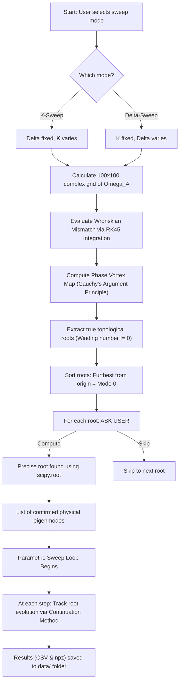

# Numerical Solutions - Main Script Documentation

This project numerically solves an Ordinary Differential Equation (ODE) system for a range of parameters and visualizes the results. Background limits and roots are calculated to match asymptotic analytical approximations.

## Mathematical Formulation

The script solves a system of second-order differential equations using complex variables. The governing equation is:

$$P y'' + P' y' - Q y = 0 \implies y'' = \frac{Q y - P' y'}{P}$$

Where $y(\tau)$ is a complex function and the prime denotes the derivative with respect to $\tau$. The functions $P(\tau)$ and $Q(\tau)$ depend on the physical parameters.

### 1. Variables and Flow Parameters

**Background variable $\xi$ :**
$$\xi(\tau, \Omega_A) = \Delta \tanh(\tau) + \Omega_A$$

**Derivate of $\xi$ :**
$$\frac{d\xi}{d\tau} = \Delta \left(1 - \tanh^2(\tau)\right)$$

### 2. Physical Intermediate Functions

**Alfvén speed parameter $\beta_A$ :**
$$\beta_A(\xi) = \alpha + \beta - 1 - \xi^2$$

**Slow/Fast sound speed parameter $\beta_Z$ :**
$$\beta_Z(\xi) = \beta + 2\alpha + \frac{2\alpha^2 \left(\xi^4 + 2g\xi^3 + 2g^2\xi^2 - 5\xi^2 - 6g\xi + 3\right)}{(\xi^2 - 1)(\xi^4 - 6\xi^2 - 4g\xi + 3)}$$

### 3. Output Coefficients $P$ and $Q$

**Coefficient $P(\tau, \Omega_A)$ :**
$$P(\tau) = \frac{\beta_A \beta_Z}{(1 - l)\beta_Z + l\beta_A}$$

**Coefficient $Q(\tau, \Omega_A)$ :**
$$Q(\tau) = k^2 \beta_A$$

*(Note: The system explicitly computes the analytical derivatives $\frac{d\beta_A}{d\tau}$, $\frac{d\beta_Z}{d\tau}$, and $\frac{dP}{d\tau}$ to evaluate the $y''$ integration step. Safeguards of `1e-12` are applied to avoid singularities at boundary points).*

### 4. Asymptotic Limits and Initial Conditions

At the boundaries where $\tau \to \pm \infty$:
- $\xi$ approaches its limit values: $\xi_{\pm} = \Omega_A \pm \Delta$
- The components $P$ and $Q$ approach asymptotic ranges $P_{\pm}, Q_{\pm}$.

The asymptotic roots $\lambda$ are extracted using:
$$\lambda_{\pm} = \sqrt{\frac{Q(\xi_{\pm})}{P(\xi_{\pm})}}$$

The initial conditions assume an incoming wave. At $\tau = -t_0$:
$$z_0 = [y_r = 1.0, y_i = 0.0, y'_r = \text{Re}(\lambda_-), y'_i = \text{Im}(\lambda_-)]$$

The target is to establish a match at the other boundary $t_0$, computing the numerical "**mismatch**" evaluated as:
$$\text{Mismatch} = | y'(+t_0) + \lambda_+ y(+t_0) |$$

---

## Execution Architecture & Logic

### Technical Implementation Details

| Component | Mathematical / Technical Method | Explanation |
| :--- | :--- | :--- |
| **ODE Integration** | `scipy.integrate.solve_ivp` (**RK45**) | The system integrates the differential equations from the boundaries $\tau = \pm t_0$ inward to the center $\tau=0$ using the explicit Runge-Kutta method of order 5(4). |
| **Mismatch Evaluation** | **Wronskian Mismatch at $\tau=0$** | To verify a global solution, the left-side and right-side integration results are compared at the origin. The "mismatch" is computed as the absolute difference of their values and derivatives: $\mid y_{left}(0) - y_{right}(0) \mid + \mid y'_{left}(0) - y'_{right}(0) \mid$. |
| **Topological Filter** | **Phase Vortex (Cauchy's Argument Principle)** | The grid generates a map of complex phases. Physical discrete eigenmodes correspond to topological phase vortices (where the phase wraps by $2\pi$ around a point). Continuous spectrum branch cuts do not form vortices. This mathematical property guarantees the algorithm only selects true physical roots. |
| **Exact Root Finding** | `scipy.root` (**hybr / MINPACK**) | Once a localized phase vortex is found, the system refines the complex guess using the Modified Powell's method (`hybr`) to pinpoint the exact root where mismatch equals zero. |
| **Parametric Sweep** | **Continuation Method** | During the sweep over $K$ or $\Delta$, the algorithm uses the precise root from the previous step as the initial guess for the next step. This allows rapid tracking of the physical mode's evolution without regenerating the heavy 100x100 grid. |
