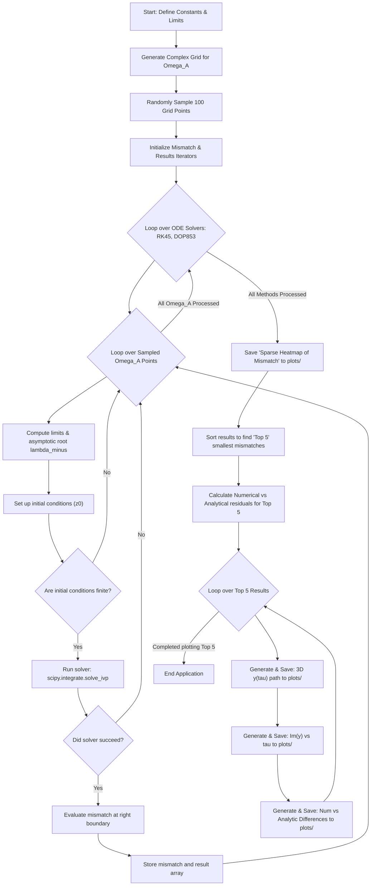
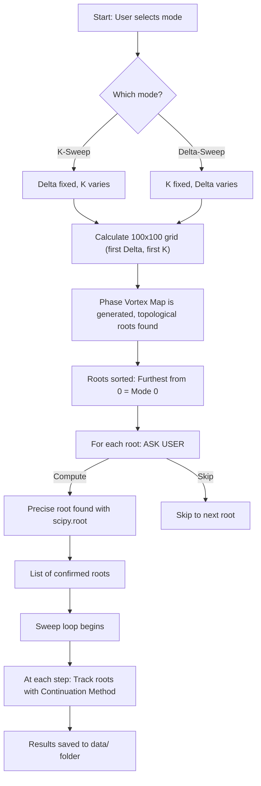

# Numerical Solutions - Main Script Documentation

This project numerically solves an Ordinary Differential Equation (ODE) system for a range of parameters and visualizes the results. Background limits and roots are calculated to match asymptotic analytical approximations.

## Mathematical Formulation

The script solves a system of second-order differential equations using complex variables. The governing equation is:

$$ P y'' + P' y' - Q y = 0 \implies y'' = \frac{Q y - P' y'}{P} $$

Where $y(\tau)$ is a complex function and the prime denotes the derivative with respect to $\tau$. The functions $P(\tau)$ and $Q(\tau)$ depend on the physical parameters.

### 1. Variables and Flow Parameters

**Background variable $\xi$ :**
$$ \xi(\tau, \Omega_A) = \Delta \tanh(\tau) + \Omega_A $$

**Derivate of $\xi$ :**
$$ \frac{d\xi}{d\tau} = \Delta \left(1 - \tanh^2(\tau)\right) $$

### 2. Physical Intermediate Functions

**Alfvén speed parameter $\beta_A$ :**
$$ \beta_A(\xi) = \alpha + \beta - 1 - \xi^2 $$

**Slow/Fast sound speed parameter $\beta_Z$ :**
$$ \beta_Z(\xi) = \beta + 2\alpha + \frac{2\alpha^2 \left(\xi^4 + 2g\xi^3 + 2g^2\xi^2 - 5\xi^2 - 6g\xi + 3\right)}{(\xi^2 - 1)(\xi^4 - 6\xi^2 - 4g\xi + 3)} $$

### 3. Output Coefficients $P$ and $Q$

**Coefficient $P(\tau, \Omega_A)$ :**
$$ P(\tau) = \frac{\beta_A \beta_Z}{(1 - l)\beta_Z + l\beta_A} $$

**Coefficient $Q(\tau, \Omega_A)$ :**
$$ Q(\tau) = k^2 \beta_A $$

*(Note: The system explicitly computes the analytical derivatives $\frac{d\beta_A}{d\tau}$, $\frac{d\beta_Z}{d\tau}$, and $\frac{dP}{d\tau}$ to evaluate the $y''$ integration step. Safeguards of `1e-12` are applied to avoid singularities at boundary points).*

### 4. Asymptotic Limits and Initial Conditions

At the boundaries where $\tau \to \pm \infty$:
- $\xi$ approaches its limit values: $\xi_{\pm} = \Omega_A \pm \Delta$
- The components $P$ and $Q$ approach asymptotic ranges $P_{\pm}, Q_{\pm}$.

The asymptotic roots $\lambda$ are extracted using:
$$ \lambda_{\pm} = \sqrt{\frac{Q(\xi_{\pm})}{P(\xi_{\pm})}} $$

The initial conditions assume an incoming wave. At $\tau = -t_0$:
$$ z_0 = [y_r = 1.0, y_i = 0.0, y'_r = \text{Re}(\lambda_-), y'_i = \text{Im}(\lambda_-)] $$

The target is to establish a match at the other boundary $t_0$, computing the numerical "**mismatch**" evaluated as:
$$ \text{Mismatch} = | y'(+t_0) + \lambda_+ y(+t_0) | $$

---

## Execution Flowchart

The following flowchart outlines the logic execution of `Main.py`.

### Flowchart Step Descriptions

| Step Code | Step Name | Detailed Explanation |
| :---: | :--- | :--- |
| **A - D** | Initialization phase | Defines theoretical limits, generates a complex 2D grid for $\Omega_A$, and selects 100 random coordinates to save computation time. Arrays for tracking mismatches are prepared. |
| **E - F** | Iteration Controls | Nested loops iterating first through the chosen ODE solver algorithms (`RK45`, `DOP853`), and then through each of the randomly sampled $\Omega_A$ parameter values. |
| **G - I** | Mathematical Limits & $z_0$ Check | Computes asymptotic limits ($\lambda_-$) at boundary limit $\tau = -t_0$ to form the initial conditions vector ($z_0$). Validates that $z_0$ avoids mathematical singularities (division by zeros) before proceeding. |
| **J** | ODE Integration (`solve_ivp`) | Main processing step. Integrates the second-order system mapped as a system of first-order initial value problems across domain $\tau \in [-t_0, t_0]$. |
| **K - M** | Output Verification | Verifies integration completion. If successful, compares the solver's boundary value output with asymptotic roots to compute the numerical "mismatch" (total error). |
| **N** | Save Global Heatmap | Plots all tested $\Omega_A$ instances on a log scaled 2D heatmap relative to their mismatch. Output is saved automatically as `Sparse_Heatmap_Mismatch.png`. |
| **O - P** | Select Top Matches | Analyzes result history to isolate the 5 specific $\Omega_A$ setups yielding the mathematically lowest total error. |
| **Q - T** | Plot Export Loop | For each of the "Top 5" hits, three visual charts (3D coordinate path trace, Imaginary trace mapping, analytical error mapping) are saved directly into the `plots/` folder as `.png` images without popping up on the screen. |
| **U** | End Application | System memory operations are complete and execution terminates. |

